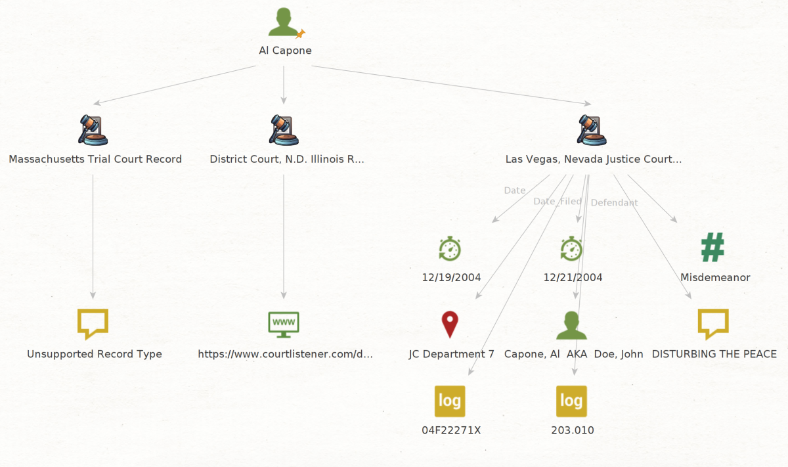

### Retrieve Judyrecord.com Results in Maltego


Version: 1.0.0-beta

## 💎 About

Retreives search results from [judyrecords](https://judyrecords.com) and extract data. Due to the extreme variance in data formatting of millions of records, it is virtually impossible to guarantee all critical data points are extracted. This is why we recommend using this tool as a supplement to and not replacement for manually reviewing results of a judyrecords search. For more information about the terms of judyrecords, see [terms](https://judyrecords.com/terms).

Please use this tool ethically by respecting people's privacy and only collecting intelligence where explicit permission has been granted or otherwise legally qualified to do so. We are not responsible for any illegal use.

## 🛠️ Setup

### Requirements
- Maltego 4.3.0
- [Python 3.11.2](./requirements.txt)

   
### Installation
```
   git clone https://github.com/kodamaChameleon/judy-maltego.git
   cd judy-maltego
   python3 setup.py
```

Import Judy-Maltego.mtz and entities from the entities folder into Maltego to begin running locally.

## 🧙 Features



| Name               | Description                                                       | Input              |
|--------------------|-------------------------------------------------------------------|--------------------|
| searchName         | Returns search results from www.judyrecords.com using name        | maltego.Person     |
| searchPhrase       | Returns search results from www.judyrecords.com using a phrase    | maltego.Phrase     |
| toCaseDetails      | Extracts case details from judyrecords.com using url              | maltego.judyRecord |

*Note*: The community edition (CE) of Maltego limits the total entities that can be returned during a single transform to 12 which is well under what many searchName/searchPhrase results will return. The transform can be run additional times until no more results are returned.

**Supported Records**  
Supported records are located at [data/supported_records.json](https://github.com/kodamaChameleon/judy-maltego/blob/main/data/supported_records.json). If an unsupported record is discovered, judy-maltego will first attempt to fingerprint the record to see if it matches an already known format type. If that fails, results will still come back using searchName or searchPhrase; however, toCaseDetails will return "Unsupported Record Type." Don't see a record you are interested in? Create an issue for us with the name of the record type and an example record you want added (i.e. `https://judyrecords.com/record/<record number here>`). Better yet, you can contribute by forking the repository, testing changes, and making pull requests for yourself. Sigh... wouldn't it be nice if they had an API!
   
## 📜 License


[Creative Commons Attribution-ShareAlike 4.0 International License](https://creativecommons.org/licenses/by-sa/4.0/)  
Copyright (C) 2023 KodamaChameleon
